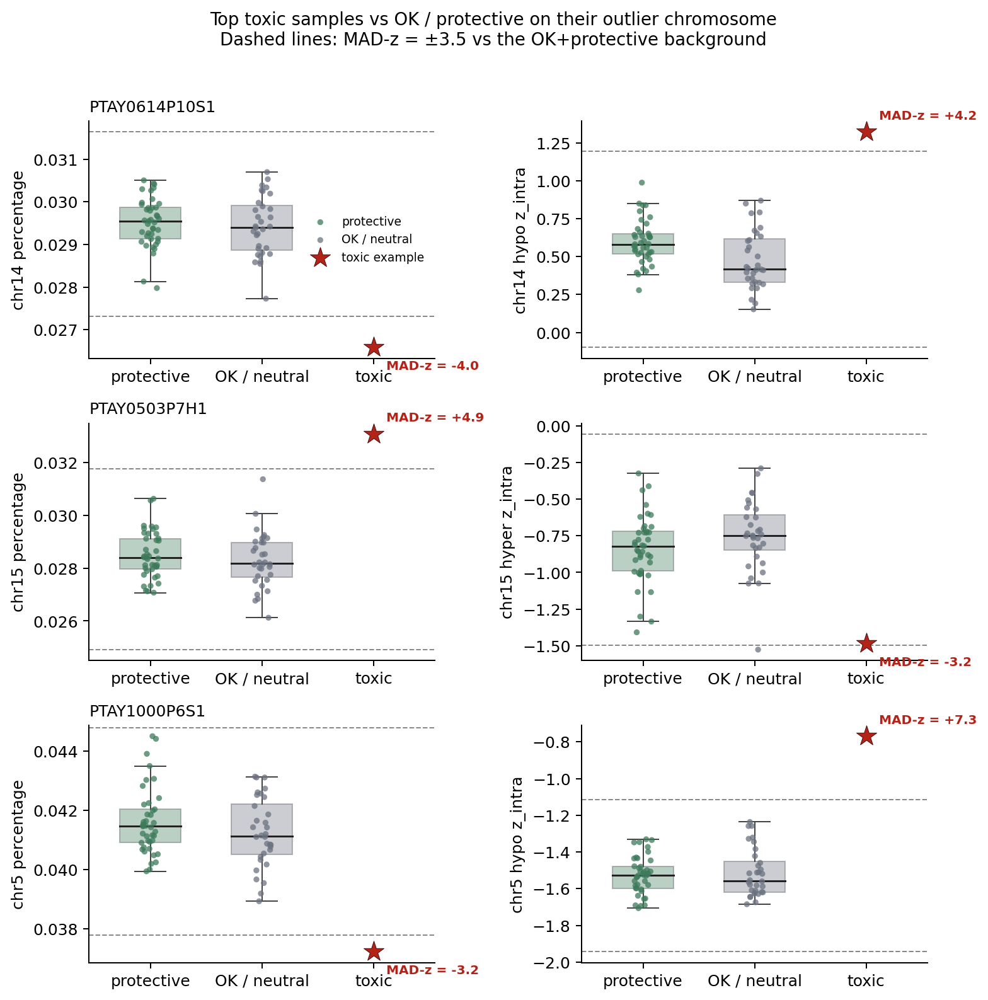

# Why some 40+40 reference draws are perfect and others fail

**Reference-pool admittance for NIPT ref-free ezscore**  
Replay of the 20260810 40+40 experiment (100k repeats, seed 42) plus a prospective redraw.  
Scripts: `scripts/ref_admittance_rule/`. Tables: `.../results/episcore_output/20260813-ref_admittance_rule/`.

---

Each ref-free repeat draws two disjoint groups of 40 from a **96-sample dev-Normal pool**: 40 for episcore/zscore mean–SD, 40 for ezscore mean–SD (16 unused). Eval is fixed: 93 Normal + 59 trisomy with `ff_before_mq ≥ 1%`, five blacklisted samples excluded. A sample is called abnormal if **any chromosome ezscore > 4.5**. Errors:

- **FP** = Normal called abnormal
- **FN** = trisomy called normal

About **98.5% of the error mass is FN**. Mean FP = 0.04; mean FN = 2.63.

---

## 1. Perfect vs bad

| Class       | Definition   | Share of 100k repeats |
| ----------- | ------------ | --------------------- |
| **Perfect** | FP+FN = 0    | 11.1%                 |
| **OK**      | FP+FN in 1–4 | 73.0%                 |
| **Bad**     | FP+FN ≥ 5    | 15.9%                 |
| **Worst**   | FP+FN ≥ 8    | 0.45%                 |

**Perfect** means that 40+40 bipartition classifies the whole eval set with no mistakes at ez = 4.5. **Bad** is the right tail already used in the 20260810 density plot (FP+FN ≥ 5), not a separate clinical cutoff.

FP+FN density

*Figure 1.* Repeat density of FP+FN. Teal = perfect. Stacked orange/blue = FP vs FN share inside each bin. The 20260810 1e6-repeat histogram matches this 100k slice (max density difference 0.0027).

No 40+40 draw can be “always perfect” in the sense that a given pool sample lives only in perfect sets: each sample is in the 80 with probability 80/96 ≈ 0.83. The useful contrast is **enrichment** — does a sample appear more often in perfect draws or in bad draws?

---

## 2. Why bad draws fail: inflated ez-ref SD

ezscore is (e+z - \mu_{\mathrm{ez}})/\sigma_{\mathrm{ez}} per chromosome. If the 40 ez refs are heterogeneous, \sigma_{\mathrm{ez}} grows, ezscores shrink, and trisomies fall below 4.5 → **FN**.

ez-ref SD vs FF spread

*Figure 2.* Left: mean ez-ref SD across chr1–22 is clearly higher in bad draws (Cliff’s δ = 0.79). Right: FF spread of the 80 is a much weaker separator.

Cliff's delta

*Figure 3.* Set-level Cliff’s δ (bad − perfect). chr14 ez-ref SD is the strongest chromosome-level shift (δ = 0.96). Percentage-ref SD is *smaller* in bad sets — the failure mode is ez normalization, not raw zscore percentage.

---

## 3. Toxic vs protective

Role **either** = sample is in the epi/z 40 **or** the ez 40 (the 80 that actually enter scoring).

**Lift** for class C (perfect or bad):

\mathrm{lift}_C = \frac{P(\text{in the 80} \mid C)}{P(\text{in the 80})}

Lift > 1 means the sample is enriched in that class relative to chance.

A pool sample is **toxic** if all three hold (Fisher exact on the 2×2 “in 80 × bad”, two-sided p < 0.05):

1. \mathrm{lift}_{\mathrm{bad}} > 1 — over-represented in bad 40+40
2. P(\text{perfect} \mid \text{unused}) > P(\text{perfect} \mid \text{in the 80}) — leaving it out helps
3. Fisher p_{\mathrm{bad}} < 0.05

A pool sample is **protective** if:

1. \mathrm{lift}_{\mathrm{perfect}} > 1
2. P(\text{perfect} \mid \text{in the 80}) > P(\text{perfect})
3. Fisher p_{\mathrm{perfect}} < 0.05

and it is not already toxic. Everyone else is **neutral**.

On this 96-pool: **23 toxic**, **41 protective**, **32 neutral**.

Ranking score used for the keep-80 rule:

\mathrm{toxicscore} = \mathrm{lift}_{\mathrm{bad}} + \big[P(\text{perfect}\mid\text{unused}) - P(\text{perfect}\mid\text{in 80})\big]

Lift scatter

*Figure 4.* Each point is one of the 96 dev-Normal pool samples. Toxic sit upper-left (bad-enriched, perfect-depleted); protective sit lower-right.

Features vs lift

*Figure 5.* Toxic lift is only partly a FF or MAD-outlier story. The dashed line is |MAD-z| = 3.5. Several high-toxicity samples sit *inside* the MAD fence; some MAD outliers are protective.

*Figure 5b.* Raw percentage (left) and the driving z_intra track (right) on each sample’s outlier chromosome. Boxes and points are **protective** (n=41) and **OK / neutral** (n=32); the star is the toxic example. Dashed lines are the MAD-z = ±3.5 fence computed from those OK+protective values only. PTAY0614 (chr14) and PTAY0503 (chr15) sit outside the percentage fence; PTAY1000 is a z_intra extreme.

Top toxic (full 100k labels):

| Sample          | FF    | % MAD-z max (chr) | z_intra MAD-z max | Notes                                          |
| --------------- | ----- | ----------------- | ----------------- | ---------------------------------------------- |
| *PTAY0614P10S1* | 2.4%  | 4.0 (chr14)       | 4.2 (chr14)       | strongest toxic; chr14 also drives ez-SD shift |
| PTAY1359P8S1    | 0.56% | 3.5               | 3.4               | no chr > 3.5                                   |
| PTAY0503P7H1    | 0.84% | 4.9 (chr15)       | 3.2               | `|final_z|` max = 6.6 as “Normal”              |
| PTAY1000P6S1    | 0.54% | 3.2               | 7.3 (many chr)    | z_intra wild, percentage milder                |
| PTAY1138P6H1    | 0.32% | 3.0               | 3.1               | FF tail (below pool 5th pct)                   |
| PTAY1266P8S1    | 9.9%  | 1.8               | 3.0               | high FF tail; **no** MAD fail                  |

So: **do not equate toxic with “looks like an outlier on one plot.”** Empirical membership in bad 40+40 is the definition; FF/MAD are screening hints.

Eval-side chronic FN (low-FF trisomy such as PTAY1186, PTAY1213) are **not** admittance candidates — they never enter the 96-pool.

---

## 4. Admittance rule for a larger future pool

### What not to rely on alone

| Screen                           | What it does                      | Retrospective ρ(n fail members, FP+FN) vs random |
| -------------------------------- | --------------------------------- | ------------------------------------------------ |
| FF outside pool 5–95th pct       | drops 10                          | 0.03 vs −0.01 (weak)                             |
| any-chr |z_intra MAD-z| > 3.5    | drops 16                          | 0.03 vs 0.01 (weak)                              |
| any-chr |percentage MAD-z| > 3.5 | drops 6                           | 0.08 vs 0.01 (modest)                            |
| union of the three               | drops 27, pool left = 69 **< 80** | 0.07 — cannot keep 40+40                         |
| **toxic_keep80** (empirical)     | drops 16, pool = 80               | **0.26 vs 0.01**                                 |

Spearman QC vs random

*Figure 6.* Matched-N random drop of the same count is the control: a real rule must beat it. Only the membership-toxic filters do.

### Causal test (new 40+40, not a subset of the 100k)

Toxic scores were computed on **even** repeats; the 16 highest `toxic_score` samples were dropped (`toxic_keep80`). Then **20k new** 40+40 draws (seed 7) from:

- remaining 80 (admitted)
- a random 80 (drop 16 at random)

Eval set unchanged.

Redraw densityRedraw bars

*Figures 7–8.*

| Pool                         | n    | Perfect rate | Mean FP+FN | Mean FN   | Mean FP |
| ---------------------------- | ---- | ------------ | ---------- | --------- | ------- |
| Original 96                  | 100k | 11.1%        | 2.67       | 2.63      | 0.041   |
| **Admitted (drop 16 toxic)** | 20k  | **91.9%**    | **0.088**  | **0.024** | 0.064   |
| Random drop of 16            | 20k  | 16.5%        | 2.06       | 1.90      | 0.16    |

The gain is not “smaller pool”: the random-80 control barely moves. Targeted removal collapses FN. FP stays negligible (0.06).

The 16 dropped IDs: `PTAY0503P7H1`, `PTAY0522P6H1`, `PTAY0530P6H1`, `PTAY0557P9S1`, `PTAY0586P8S1`, `PTAY0614P10S1`, `PTAY0735P9S1`, `PTAY0811P8S1`, `PTAY1000P6S1`, `PTAY1138P6H1`, `PTAY1187P6S1`, `PTAY1266P8S1`, `PTAY1359P8S1`, `PTAY1360P7S1`, `PTAY1374P8S1`, `PTAY1398P8S1`.

### Rule to apply when expanding the pool

Use **two tiers**. Feature screens are cheap and apply to a new Normal before it ever enters a 40+40 sweep. They are **not** sufficient. The rule that actually moved ref-free results is empirical toxicity.

**Tier A — candidate screen (no repeats needed)**  
Apply to every new Normal relative to the *current* working pool:

1. Compute per-chr **percentage** and **hypo/hyper z_intra** at the production combo (ep 0.5/0.65, z 0.85/0.95).
2. MAD-z vs the current pool. **Hold** (do not auto-admit) if any chromosome has percentage MAD-z > 3.5 **or** z_intra MAD-z > 3.5.
3. Hold if `ff_before_mq` is outside the pool 1st–99th percentile, or if max `final_zscores` as labelled Normal is large (this cohort: PTAY0503 at 6.6).
4. Held samples can still be tested in Tier B; they are not a hard clinical blacklist until toxicity is confirmed.

**Tier B — empirical admittance (required before growing the 40+40 pool)**  
After adding candidates:

1. Rebuild the pool (old admitted + new candidates that you want to test). Need **n ≥ 80** to keep 40+40.
2. Run ≥10k 40+40 repeats (same eval mask, ez = 4.5). Split repeats even/odd.
3. On the even slice, score `toxic_score` as above. Drop the highest-scoring samples until the remaining pool is still ≥ 80 (or until Fisher-toxic set is empty).
4. Prove on **new** draws from the filtered pool vs a **size-matched random drop**. Require: higher perfect rate, lower mean FN, FP not inflated, and Spearman ρ(n fail members, FP+FN) clearly above the random-drop null.
5. Only then freeze the expanded pool.

**Practical default for the next expansion**

- Never grow the 96 by concatenation without a 40+40 sweep.
- Prefer dropping a few empirically toxic samples over keeping MAD-clean samples that are bad-enriched.
- If the filtered pool would fall below 80, either lower `ref_n` or collect more clean Normals — do not force 40+40 from a toxic-contaminated 96.
- Recompute MAD-z against the *updated* pool; MAD fences drift as the pool changes.

---

## 5. Caveats

- Toxic labels use the same eval set as the redraw. The even/odd split plus a new seed for the 20k redraw is the leakage control we have; a fully external eval cohort would be stronger.
- 40+40 from n = 80 uses the entire remaining pool every repeat (no unused 16). That is intended: it is the production-like “best 80” after filtering.
- MAD cutoffs (3.5) were not re-tuned; they are conventional robust-z fences. The data say they are optional screens, not the admittance rule.
- Interactive HTML plots (same analysis) live under `baseline96/analysis/plots/`.

Regenerate PNGs: `python3 scripts/ref_admittance_rule/render_report_figures.py`.